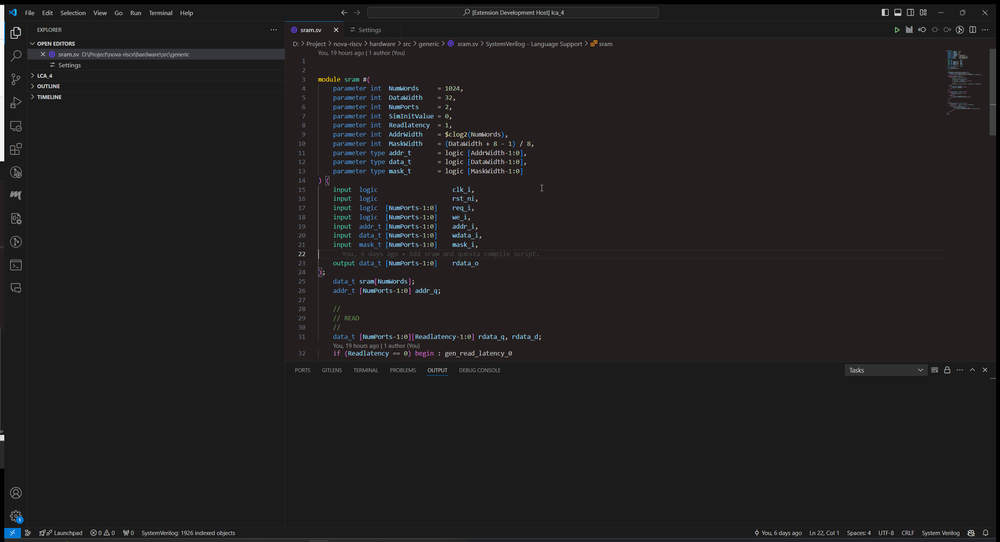
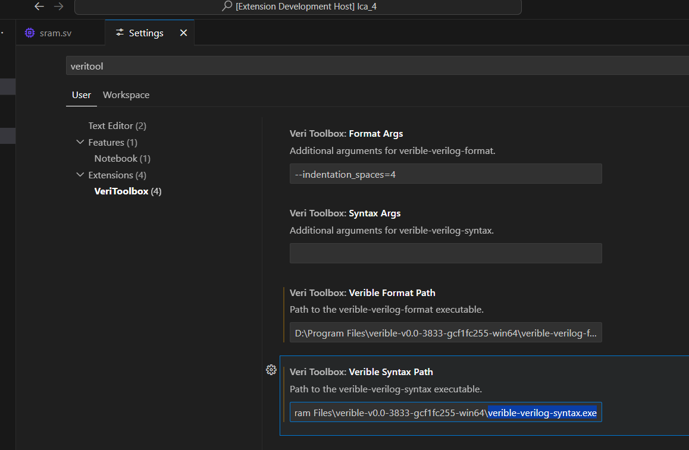

# VeriToolbox

VeriToolbox is a VSCode extension aimed at helping Verilog and SystemVerilog developers work more efficiently. With simple commands, you can quickly generate module instantiations, create testbenches, and format your code.

Using the Verible backend, utilizing its parser and formatter.

## Features

- **Generate Module Instantiation to Clipboard**: Quickly copy the module instantiation code of the current file to the clipboard.
- **Insert Module Instantiation from File**: Select a file and insert its module instantiation code at the current cursor position.
- **Generate Testbench to Clipboard**: Automatically generate a testbench for the module in the current file and copy it to the clipboard.
- **Insert Testbench from File**: Select a file and insert its testbench code at the current cursor position.
- **Code Formatting**: Format selected Verilog/SystemVerilog code (coming soon).

## Installation

You can install VeriToolbox in two ways:

1. **VSCode Marketplace**: Search for `VeriToolbox` in the VSCode Marketplace and install it.
2. **VSIX File**: Download the latest `.vsix` file from the GitHub releases page and install it in VSCode by selecting `Extensions` -> `Install from VSIX...`.

## Usage

### Configuration

Before using this extension, ensure you have [Verible](https://github.com/chipsalliance/verible) installed and configured the path to Verible in the extension settings.

You can add Verible to PATH or use absolute path.

### Commands

- `VeriToolbox.generateInstanceToClipboard`: Generate module instantiation for the current file and copy it to the clipboard.
- `VeriToolbox.insertInstanceFromFile`: Select a file to instantiate and insert the code at the current position.
- `VeriToolbox.generateTestbenchToClipboard`: Generate a testbench for the module in the current file and copy it to the clipboard.
- `VeriToolbox.insertTestbenchFromFile`: Select a file to generate a testbench and insert the code at the current position.
- `VeriToolbox.formatSelection`: Format the selected Verilog/SystemVerilog code.
